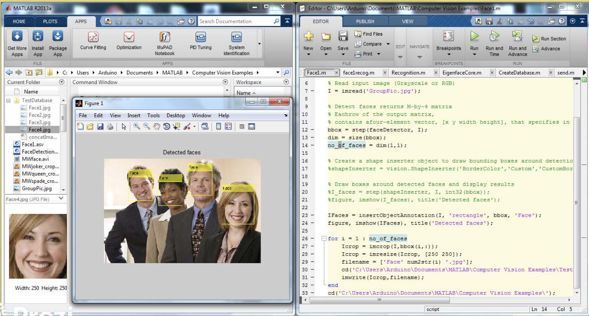
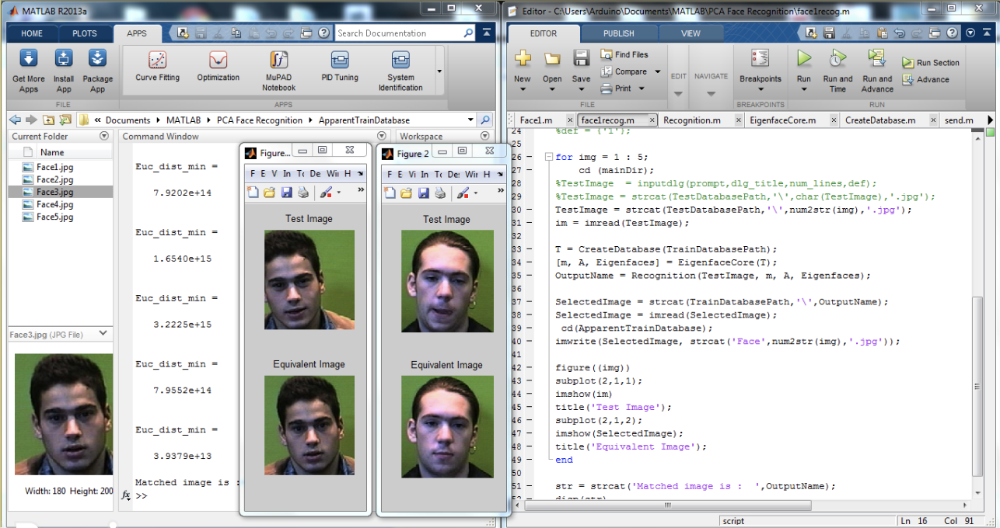

# matlab-fr
AI facial recognition experiments for matlab
An android application was designed which allowed user to take picture and then compared the detected faces with those existing in the cloud database. The detection and recognition was done on a PC on the local network to utilize the power of computers which are ideal otherwise to exploit its processing capabilities.

The project can be further developed and can find applications were security is the concern.
- Access Control
- Identification by authorities
- Surveillance
- Archiving

Presentation: https://prezi.com/eylck0ponhol/cloud-based-face-recognition-application-processed-by-matlab
